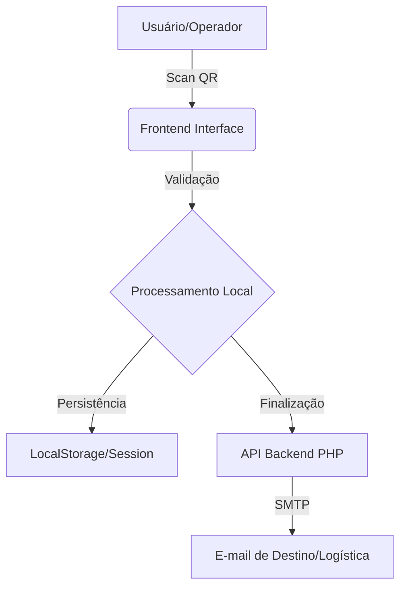

# FlowVerify — Gestão de Expedição & Coleta de Dados


O **FlowVerify** é uma solução corporativa desenvolvida para a **Facchini S/A**, focada na otimização dos fluxos de expedição e coleta de dados em ambiente logístico. O sistema permite a rastreabilidade precisa de mercadorias através de leitura automatizada de etiquetas (QR Code/Barcode), reduzindo erros operacionais e aumentando a produtividade.

---

## 🚀 Principais Funcionalidades

- **Leitura Automatizada**: Captura de dados rápida via câmera ou leitor físico (USB/Bluetooth).
- **Gestão em Tempo Real**: Lista dinâmica de itens coletados com contador automático e validação.
- **Módulo de Expedição**: Seleção inteligente de unidades de destino (filiais) com sistema de busca e filtragem por estado.
- **Sincronização Segura**: Finalização e envio dos dados coletados via protocolo SMTP seguro.
- **Histórico Local**: Acesso rápido a registros anteriores diretamente no dispositivo.
- **Interface Mobile-First**: Design responsivo e intuitivo, otimizado para coletores de dados e smartphones.

---

## 🛠️ Tecnologias Utilizadas

### Frontend
- **HTML5 & CSS3**: Estrutura semântica e estilização premium com variáveis (CSS Variables).
- **Vanilla JavaScript**: Lógica de aplicação pura para máxima performance.
- **Lucide Icons**: Conjunto de ícones vetoriais modernos.
- **HTML5-QRCode**: Motor de leitura de alta performance para navegadores.

### Backend
- **PHP 8.0+**: API robusta para processamento de dados.
- **Composer**: Gestão de dependências backend.
- **PHPMailer**: Integração segura para envio de relatórios logísticos.

---

## 🏗️ Arquitetura do Projeto



---

## ⚙️ Instalação e Configuração

Para configurar o ambiente de desenvolvimento local, siga os passos abaixo:

1. **Clonar o Repositório**
   ```bash
   git clone https://github.com/ruanlatorre/projeto_expedicao.git
   ```

2. **Configurar Backend**
   Navegue até a pasta `backend` e instale as dependências:
   ```bash
   cd backend
   composer install
   ```

3. **Ambiente de Servidor**
   - Utilize o **XAMPP**, **WAMP** ou **Laragon**.
   - Aponte o DocumentRoot para a pasta raiz do projeto.
   - Certifique-se de que a extensão `openssl` e `mbstring` do PHP estão ativas para o PHPMailer.

4. **Acesso**
   Abra o navegador em `http://localhost/projeto_expedicao`.

---

## 📄 Licença

Este projeto é de uso exclusivo e propriedade da **Facchini S/A**. Todos os direitos reservados.

---

<p align="center">
  <sub>Desenvolvido para otimizar a logística brasileira.</sub>
</p>
